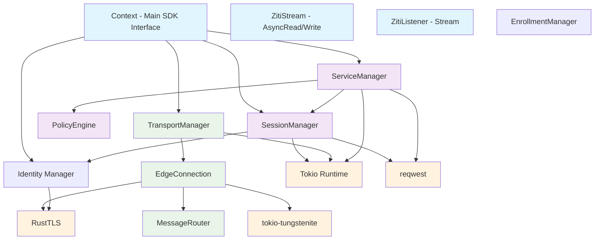
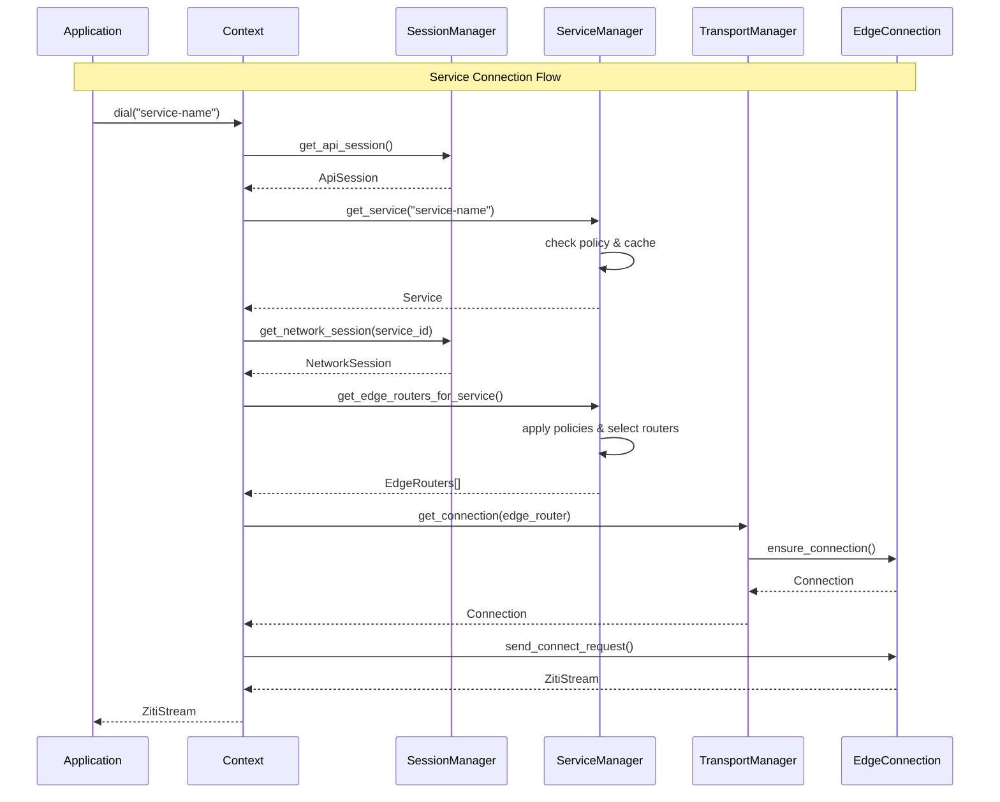

# Ziti Rust SDK Architecture

## Overview

This document describes the architecture for the Ziti Rust SDK, a high-performance, async-first implementation that provides Rust applications with secure, zero-trust networking capabilities through the OpenZiti platform.

### Design Goals

- **Rust-Idiomatic**: Leverage Rust's strengths in safety, concurrency, and performance
- **Async-First**: Built on tokio with async/await throughout the API
- **Type-Safe**: Comprehensive error handling with Result types
- **Zero-Copy**: Efficient data handling where possible
- **Concurrent**: Background tasks for session management and health monitoring
- **Secure**: Certificate-based authentication with proper TLS validation
- **Resilient**: Automatic reconnection and session renewal
- **Performant**: Connection pooling and intelligent edge router selection

### Target Ecosystem

- **Runtime**: Tokio for async operations
- **TLS**: RustTLS for certificate handling
- **WebSocket**: tokio-tungstenite for transport
- **HTTP**: reqwest for controller API calls
- **Serialization**: serde for JSON handling

## Core Module Structure

```
ziti-rust/
├── src/
│   ├── lib.rs                    // Public API exports
│   ├── context/                  // Core Context implementation
│   │   ├── mod.rs
│   │   ├── context.rs           // Main Context struct and impl
│   │   └── builder.rs           // Context builder pattern
│   ├── identity/                 // Identity and authentication
│   │   ├── mod.rs
│   │   ├── config.rs            // Identity configuration
│   │   ├── enrollment.rs        // Enrollment process
│   │   └── credentials.rs       // Certificate management
│   ├── session/                  // Session management
│   │   ├── mod.rs
│   │   ├── api_session.rs       // Controller API sessions
│   │   ├── network_session.rs   // Service network sessions
│   │   └── manager.rs           // Session lifecycle management
│   ├── connection/               // Network connections
│   │   ├── mod.rs
│   │   ├── dial.rs              // Client connections
│   │   ├── listen.rs            // Server listeners
│   │   └── stream.rs            // Connection streams
│   ├── transport/                // Network transport layer
│   │   ├── mod.rs
│   │   ├── websocket.rs         // WebSocket transport
│   │   ├── tls.rs               // TLS handling
│   │   └── protocol.rs          // Ziti protocol implementation
│   ├── service/                  // Service discovery and management
│   │   ├── mod.rs
│   │   ├── discovery.rs         // Service lookup
│   │   ├── policy.rs            // Policy evaluation
│   │   └── terminator.rs        // Terminator management
│   ├── error/                    // Error types and handling
│   │   ├── mod.rs
│   │   └── types.rs             // Error enums and implementations
│   ├── config/                   // Configuration management
│   │   ├── mod.rs
│   │   ├── options.rs           // Dial/Listen options
│   │   └── settings.rs          // SDK settings
│   └── util/                     // Utilities
│       ├── mod.rs
│       ├── retry.rs             // Retry mechanisms
│       └── time.rs              // Timeout handling
```

## Primary Data Structures

### Context - Central SDK Interface

```rust
pub struct Context {
    identity: Arc<Identity>,
    session_manager: Arc<SessionManager>,
    service_manager: Arc<ServiceManager>,
    transport: Arc<Transport>,
    config: ZitiConfig,
}

impl Context {
    pub async fn dial(&self, service_name: &str) -> Result<ZitiStream, ZitiError>;
    pub async fn listen(&self, service_name: &str) -> Result<ZitiListener, ZitiError>;
    pub async fn dial_with_options(&self, service_name: &str, options: DialOptions) -> Result<ZitiStream, ZitiError>;
    pub async fn listen_with_options(&self, service_name: &str, options: ListenOptions) -> Result<ZitiListener, ZitiError>;
}
```

### Identity and Configuration

```rust
pub struct Identity {
    pub id: String,
    pub certificates: CertificateChain,
    pub private_key: PrivateKey,
    pub ca_pool: Vec<Certificate>,
}

pub struct ZitiConfig {
    pub controller_url: Url,
    pub identity: Identity,
    pub connect_timeout: Duration,
    pub enable_ha: bool,
    pub max_connections: Option<u32>,
}
```

### Sessions

```rust
pub struct ApiSession {
    pub id: String,
    pub token: String,
    pub expires_at: SystemTime,
    pub edge_routers: Vec<EdgeRouter>,
}

pub struct NetworkSession {
    pub id: String,
    pub service_id: String,
    pub edge_routers: Vec<EdgeRouter>,
    pub circuit_id: Option<String>,
}
```

### Connection Types

```rust
pub struct ZitiStream {
    inner: Box<dyn AsyncRead + AsyncWrite + Send + Unpin>,
    circuit_id: Option<String>,
    session: NetworkSession,
}

pub struct ZitiListener {
    service_name: String,
    options: ListenOptions,
    session_manager: Arc<SessionManager>,
    receiver: Receiver<ZitiStream>,
}
```

## Public API Design

### Main API Interface

```rust
// Primary Context API with async/await
impl Context {
    /// Create context from configuration
    pub async fn new(config: ZitiConfig) -> ZitiResult<Self>;
    
    /// Create context from identity file
    pub async fn from_file<P: AsRef<Path>>(path: P) -> ZitiResult<Self>;
    
    /// Dial a service by name
    pub async fn dial(&self, service_name: &str) -> ZitiResult<ZitiStream>;
    
    /// Listen on a service
    pub async fn listen(&self, service_name: &str) -> ZitiResult<ZitiListener>;
}

// Builder pattern for configuration
impl ContextBuilder {
    pub fn new() -> Self;
    pub fn identity_file<P: AsRef<Path>>(self, path: P) -> Self;
    pub fn connect_timeout(self, timeout: Duration) -> Self;
    pub async fn build(self) -> ZitiResult<Context>;
}

// Stream integration with tokio
impl tokio::io::AsyncRead for ZitiStream { /* ... */ }
impl tokio::io::AsyncWrite for ZitiStream { /* ... */ }
impl Stream for ZitiListener { 
    type Item = ZitiResult<ZitiStream>;
}
```

### Usage Examples

```rust
// Client example
let context = Context::from_file("client-identity.json").await?;
let stream = context.dial("echo-service").await?;
// Use stream with any tokio-compatible API

// Server example  
let context = Context::from_file("server-identity.json").await?;
let mut listener = context.listen("echo-service").await?;

while let Ok(stream) = listener.accept().await {
    tokio::spawn(async move {
        // Handle connection
    });
}

// Builder pattern
let context = ContextBuilder::new()
    .identity_file("identity.json")
    .connect_timeout(Duration::from_secs(30))
    .build()
    .await?;
```

## Error Handling Strategy

### Primary Error Types

```rust
pub type ZitiResult<T> = Result<T, ZitiError>;

#[derive(Error, Debug)]
pub enum ZitiError {
    // Network and connection errors
    #[error("Connection failed: {0}")]
    ConnectionFailed(String),
    
    #[error("Connection timeout after {timeout:?}")]
    ConnectionTimeout { timeout: Duration },
    
    // Authentication and session errors
    #[error("Authentication failed: {reason}")]
    AuthenticationFailed { reason: String },
    
    #[error("API session expired")]
    ApiSessionExpired,
    
    // Service and policy errors
    #[error("Service not found: {service_name}")]
    ServiceNotFound { service_name: String },
    
    #[error("Service access denied: {service_name}")]
    ServiceAccessDenied { service_name: String },
    
    // Configuration errors
    #[error("Configuration error: {0}")]
    ConfigError(String),
    
    // Protocol errors
    #[error("Protocol error: {message}")]
    ProtocolError { message: String },
}
```

### Error Categorization

```rust
impl ZitiError {
    /// Returns true if this is a recoverable error that should trigger retry
    pub fn is_recoverable(&self) -> bool;
    
    /// Returns true if this error should trigger session renewal
    pub fn requires_session_renewal(&self) -> bool;
    
    /// Returns true if this is a configuration or setup error
    pub fn is_configuration_error(&self) -> bool;
}
```

## Concurrency Model

### Core Architecture

- **Tokio Runtime**: Full async/await with proper task spawning
- **Shared State**: Arc + RwLock/Mutex for thread-safe access
- **Message Passing**: mpsc channels for communication between tasks
- **Background Tasks**: Automatic session renewal, health checks, service discovery
- **Connection Pooling**: Concurrent edge router connections with health monitoring
- **Graceful Shutdown**: Proper cleanup of background tasks

### Session Manager Concurrency

```rust
pub struct SessionManager {
    api_session: RwLock<Option<ApiSession>>,
    network_sessions: RwLock<HashMap<String, NetworkSession>>,
    renewal_tasks: Mutex<HashMap<String, JoinHandle<()>>>,
    session_events_tx: broadcast::Sender<SessionEvent>,
}

impl SessionManager {
    // Background task for API session renewal
    async fn start_api_session_renewal(&self, session: ApiSession);
    
    // Concurrent session creation with proper error handling
    pub async fn get_or_create_network_session(&self, service_id: &str) -> ZitiResult<NetworkSession>;
}
```

## Identity and Authentication

### Identity Management

```rust
pub struct Identity {
    pub id: String,
    pub certificate_chain: Vec<Certificate>,
    pub private_key: PrivateKey,
    pub ca_store: RootCertStore,
    pub config: IdentityConfig,
    pub metadata: IdentityMetadata,
}

pub struct IdentityBuilder {
    config: Option<IdentityConfig>,
    certificate_data: Option<String>,
    private_key_data: Option<String>,
    validate_certificates: bool,
}
```

### Enrollment Support

```rust
pub struct EnrollmentManager {
    http_client: reqwest::Client,
    ca_store: RootCertStore,
}

impl EnrollmentManager {
    pub async fn enroll_with_jwt(&self, jwt_token: &str) -> ZitiResult<IdentityConfig>;
    pub async fn enroll_from_file<P: AsRef<Path>>(&self, jwt_file: P) -> ZitiResult<IdentityConfig>;
}
```

### Authentication Providers

```rust
#[async_trait::async_trait]
pub trait AuthenticationProvider: Send + Sync {
    async fn authenticate(&self, identity: &Identity, controller_url: &Url) -> ZitiResult<AuthenticationToken>;
    async fn refresh_token(&self, current_token: &AuthenticationToken) -> ZitiResult<AuthenticationToken>;
}
```

## Session Management with Reconnection

### Automatic Session Renewal

```rust
pub struct SessionManager {
    // Background renewal with exponential backoff
    async fn ensure_api_session(&self) -> ZitiResult<ApiSession>;
    
    // Health monitoring and proactive renewal
    async fn start_api_session_renewal_task(&self, session: ApiSession);
    
    // Session event broadcasting
    pub fn subscribe_to_events(&self) -> broadcast::Receiver<SessionEvent>;
}

#[derive(Debug, Clone)]
pub enum SessionEvent {
    ApiSessionCreated(ApiSession),
    ApiSessionRenewed(ApiSession),
    ApiSessionExpired,
    ApiSessionFailed { error: String, retry_in: Duration },
    ReconnectionStarted,
    ReconnectionCompleted,
}
```

### Reconnection Logic

```rust
pub struct ReconnectingSessionManager {
    inner: Arc<SessionManager>,
    reconnection_state: Arc<RwLock<ReconnectionState>>,
}

#[derive(Debug, Clone)]
enum ReconnectionState {
    Connected,
    Reconnecting { attempt: u32, next_attempt_at: Instant },
    Failed { error: String },
}
```

## Network Communication Layer

### Transport Architecture

```rust
pub struct TransportManager {
    tls_config: Arc<ClientConfig>,
    edge_connections: Arc<RwLock<HashMap<String, Arc<EdgeConnection>>>>,
    message_router: Arc<MessageRouter>,
}

pub struct EdgeConnection {
    edge_router_id: String,
    websocket: Arc<Mutex<Option<WebSocketStream<MaybeTlsStream<TcpStream>>>>>,
    outbound_tx: mpsc::UnboundedSender<ZitiMessage>,
    inbound_rx: Arc<Mutex<mpsc::UnboundedReceiver<ZitiMessage>>>,
    state: Arc<RwLock<ConnectionState>>,
    metrics: Arc<ConnectionMetrics>,
}
```

### Ziti Protocol Implementation

```rust
#[derive(Debug, Clone)]
pub struct ZitiMessage {
    pub content_type: u32,
    pub sequence: u32,
    pub reply_to: Option<u32>,
    pub headers: HashMap<u32, Vec<u8>>,
    pub body: Bytes,
}

impl ZitiMessage {
    pub const CONNECT_REQUEST: u32 = 60783;
    pub const DATA: u32 = 60786;
    pub const CLOSE: u32 = 60787;
    pub const PING: u32 = 60788;
    
    pub fn serialize(&self) -> ZitiResult<Bytes>;
    pub fn deserialize(data: Bytes) -> ZitiResult<Self>;
}
```

### Message Routing

```rust
pub struct MessageRouter {
    sequence_generator: AtomicU32,
    pending_requests: Arc<RwLock<HashMap<u32, oneshot::Sender<ZitiMessage>>>>,
    message_handlers: Arc<RwLock<HashMap<u32, Arc<dyn MessageHandler>>>>,
}
```

## Service Discovery and Policy Evaluation

### Service Management

```rust
pub struct ServiceManager {
    controller_client: Arc<ControllerClient>,
    session_manager: Arc<SessionManager>,
    service_cache: Arc<RwLock<ServiceCache>>,
    policy_engine: Arc<PolicyEngine>,
    router_selector: Arc<EdgeRouterSelector>,
}

impl ServiceManager {
    pub async fn get_service(&self, service_name: &str) -> ZitiResult<Option<Service>>;
    pub async fn get_accessible_services(&self) -> ZitiResult<Vec<Service>>;
    pub async fn get_edge_routers_for_service(&self, service: &Service, session: &NetworkSession) -> ZitiResult<Vec<EdgeRouter>>;
}
```

### Policy Engine

```rust
pub struct PolicyEngine {
    identity_roles: Arc<RwLock<HashSet<String>>>,
    policy_cache: Arc<RwLock<PolicyCache>>,
}

impl PolicyEngine {
    pub async fn can_dial_service(&self, service: &Service) -> bool;
    pub async fn can_bind_service(&self, service: &Service) -> bool;
    pub async fn get_allowed_edge_routers(&self, available_routers: &[EdgeRouter]) -> Vec<EdgeRouter>;
}
```

### Edge Router Selection

```rust
pub struct EdgeRouterSelector {
    selection_strategy: RouterSelectionStrategy,
    router_metrics: Arc<RwLock<HashMap<String, RouterMetrics>>>,
}

#[derive(Debug, Clone)]
pub enum RouterSelectionStrategy {
    Random,
    RoundRobin,
    LatencyBased,
    LoadBased,
}
```

## Module Dependencies



## Component Interaction Flow



## Performance Considerations

### Connection Pooling
- Multiple connections per edge router
- Health monitoring and automatic recovery
- Load balancing across available connections

### Caching Strategy
- Service cache with TTL-based expiration
- Policy cache with background refresh
- Session caching with proactive renewal

### Zero-Copy Operations
- Bytes type for message payloads
- Efficient serialization/deserialization
- Minimal data copying in transport layer

### Background Task Management
- Separate tasks for session renewal, health monitoring, and cache refresh
- Proper task coordination and shutdown handling
- Resource cleanup on context drop

## Security Considerations

### Certificate Validation
- Full certificate chain validation
- CA store management with system and custom certificates
- Certificate expiration monitoring

### TLS Security
- Modern TLS configuration with secure ciphersuites
- Certificate-based mutual authentication
- Proper hostname verification

### Session Security
- Secure token storage and transmission
- Session expiration and renewal
- Audit trail for authentication events

### Input Validation
- Message format validation
- Header and payload size limits
- Protocol version validation

## Implementation Roadmap

### Phase 1: Core Infrastructure
- Basic module structure and error types
- Identity management and certificate handling
- Configuration and builder patterns

### Phase 2: Session Management
- API session creation and renewal
- Network session management
- Background task coordination

### Phase 3: Transport Layer
- WebSocket connection management
- Ziti protocol implementation
- Message routing and handling

### Phase 4: Service Discovery
- Service cache and policy engine
- Edge router selection
- Background refresh mechanisms

### Phase 5: Public API
- Context implementation
- ZitiStream and ZitiListener
- Integration testing and optimization

### Phase 6: Advanced Features
- Performance optimization
- Metrics and monitoring
- Documentation and examples

## Dependencies

### Required Crates
```toml
[dependencies]
tokio = { version = "1", features = ["full"] }
tokio-tungstenite = "0.29"
rustls = "0.23"
tokio-rustls = "0.26"
reqwest = { version = "0.13", features = ["rustls", "webpki-roots"] }
serde = { version = "1", features = ["derive"] }
serde_json = "1"
url = "2.5"
bytes = "1"
thiserror = "2"
async-trait = "0.1"
uuid = { version = "1", features = ["v4"] }
time = { version = "0.3", features = ["serde"] }
rustls-pemfile = "2"
webpki-roots = "1"
```

## Conclusion

This architecture provides a robust foundation for the Ziti Rust SDK, leveraging Rust's strengths in safety, performance, and concurrency. The design emphasizes:

- **Type Safety**: Comprehensive error handling and strong typing
- **Performance**: Async operations, connection pooling, and efficient caching
- **Security**: Certificate-based authentication and proper TLS handling
- **Reliability**: Automatic reconnection and session management
- **Maintainability**: Clear module separation and well-defined interfaces

The implementation follows Rust best practices and idiomatic patterns while maintaining functional compatibility with the existing Ziti ecosystem.